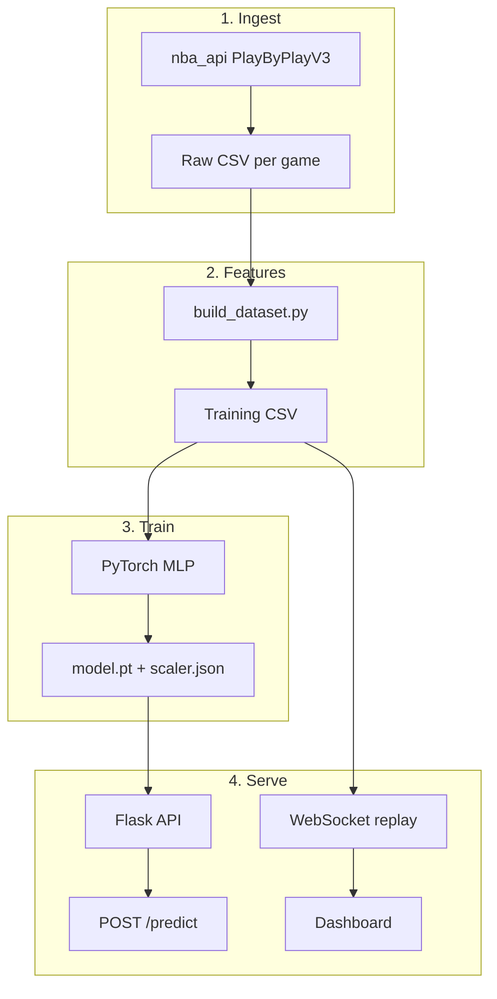

# NBA Live Win Probability

<p align="center">
  <strong>End-to-end machine learning app that estimates in-game NBA win probability from playoff play-by-play data.</strong>
</p>

<p align="center">
  <a href="#features">Features</a> •
  <a href="#quick-start">Quick Start</a> •
  <a href="#how-to-read-the-dashboard">Dashboard Guide</a> •
  <a href="#api-reference">API</a> •
  <a href="#model">Model</a> •
  <a href="#roadmap">Roadmap</a>
</p>

<p align="center">
  
  
  
  
  
</p>

---

## Overview

**NBA Live Win Probability** is a portfolio-grade ML pipeline that answers a simple question at any moment in a game:

> *Given the score, clock, and game context right now — how likely is each team to win?*

The project ingests historical **NBA playoff** play-by-play via [`nba_api`](https://github.com/swar/nba_api), engineers game-state features, trains a feed-forward neural network in **PyTorch**, and serves predictions through a **Flask** REST API and **WebSocket** replay. A lightweight **Chart.js** dashboard visualizes win probability over time.

This MVP intentionally focuses on a complete local workflow — **ingest → features → train → serve → visualize** — without premature complexity (auth, databases, Docker, or cloud deployment).

---

## Features

| Capability | Description |
|------------|-------------|
| **Data ingestion** | Fetches playoff play-by-play (PlayByPlayV3) with retries and rate limiting |
| **Feature engineering** | Builds labeled snapshots per play (score, clock, possession, fouls) |
| **ML model** | PyTorch MLP with normalized inputs and sigmoid output |
| **REST API** | `POST /predict` for single game-state inference |
| **Live replay** | WebSocket streams a real game event-by-event (~1 Hz) |
| **Dashboard** | Team-labeled scores, home/away win %, and a live probability chart |
| **Defensive parsing** | Handles inconsistent NBA API fields with sensible fallbacks |

---

## How it works



1. **Fetch** — Download a small sample of playoff games (default: 8 games, 2023–24 season).
2. **Build** — Convert each play-by-play event into training rows from both team perspectives.
3. **Train** — Fit a neural network to predict whether the team in that game state eventually won.
4. **Serve** — Load the model at runtime; score new states via HTTP or replay a saved game over WebSockets.
5. **Visualize** — The dashboard shows **home team win %**; away win % = `100% − home %`.

---

## How to read the dashboard

After you click **Connect** → **Start Replay**:

| UI element | Meaning |
|------------|---------|
| **Game banner** (e.g. `DAL @ BOS`) | Away team @ home team for the replayed game |
| **Score** `BOS 98 – DAL 102` | Home team first, away team second |
| **BOS win chance** | Model estimate that the **home** team wins from this exact moment |
| **DAL: 27%** | Away team’s implied chance (`100% − home %`) |
| **Orange chart** | How home win probability changed across the replay |

> **Note:** Win probability is always from the **home team’s** perspective in replay mode. The model was trained on historical snapshots where the label is “did this team eventually win?”

---

## Tech stack

| Layer | Tools |
|-------|--------|
| Language | Python 3.11+ |
| Data | `nba_api`, pandas |
| ML | PyTorch, scikit-learn (scaling & metrics) |
| API | Flask, Flask-SocketIO, Flask-CORS, eventlet |
| Frontend | HTML, CSS, JavaScript, Chart.js, Socket.IO client |

---

## Project structure

```
nba-live-win-probability/
├── backend/
│   ├── app.py                  # Flask + SocketIO server
│   ├── setup.sh                # One-shot: venv, deps, fetch, train
│   ├── requirements.txt
│   ├── data/
│   │   ├── raw/                # Play-by-play CSVs + games_index.csv
│   │   └── processed/          # win_probability_dataset.csv
│   ├── models/
│   │   ├── win_probability_model.pt
│   │   └── scaler.json
│   └── src/
│       ├── fetch_games.py      # Download playoff PBP
│       ├── build_dataset.py    # Feature engineering
│       ├── train_model.py      # Train & evaluate
│       ├── predict.py          # Inference helper
│       └── model.py            # Network definition
└── frontend/
    ├── index.html
    ├── styles.css
    └── app.js                  # Dashboard + WebSocket client
```

---

## Quick start

### Prerequisites

- **Python 3.11+**
- Internet access for `nba_api` (first-time data fetch)
- Two terminal windows (backend + frontend)

### 1. Clone and set up the backend

```bash
git clone https://github.com/vishalDalavayi/nba-live-win-probability_model.git
cd nba-live-win-probability_model/backend

python3 -m venv .venv
source .venv/bin/activate          # Windows: .venv\Scripts\activate
pip install -r requirements.txt
```

**Or use the setup script** (venv, install, fetch, build, train):

```bash
cd backend
chmod +x setup.sh
./setup.sh
```

Run commands **one line at a time** if you prefer manual steps:

```bash
python -m src.fetch_games
python -m src.build_dataset
python -m src.train_model
```

Re-fetching skips games already saved under `data/raw/`. Expect ~30–60 seconds for 8 games.

### 2. Start the API

```bash
cd backend
source .venv/bin/activate
python app.py
```

API available at **http://127.0.0.1:5000**

### 3. Start the dashboard

In a **second terminal**:

```bash
cd frontend
python3 -m http.server 8080
```

Open **http://127.0.0.1:8080** → set backend URL to `http://127.0.0.1:5000` → **Connect** → **Start Replay**.

### 4. Verify health

```bash
curl http://127.0.0.1:5000/health
```

---

## Data pipeline

### `fetch_games.py`

- Source: [nba_api](https://github.com/swar/nba_api) **PlayByPlayV3** (V2 is deprecated)
- Default: **8 playoff games**, **2023–24** season
- Output: `backend/data/raw/pbp_<GAME_ID>.csv` and `games_index.csv`

### `build_dataset.py`

For each play-by-play event, creates **two rows** (home + away perspective):

| Feature | Description |
|---------|-------------|
| `period` | Quarter (1–4, OT as 5+) |
| `seconds_remaining` | Approximate seconds left on game clock |
| `score_differential` | Current team score − opponent score |
| `home_team` | `1` if row is from home team’s view, else `0` |
| `possession_team` | `1` if this team has possession (best-effort) |
| `team_fouls` / `opponent_fouls` | Running foul counters (0 if unavailable) |
| `win_label` | `1` if this team won the game, else `0` |

Output: `backend/data/processed/win_probability_dataset.csv`

---

## Model

### Architecture

```
Input (7 features)
  → Linear(64) → ReLU
  → Linear(32) → ReLU
  → Linear(1)  → Sigmoid
  → Win probability ∈ (0, 1)
```

Defined in `backend/src/model.py`.

### Training

| Setting | Value |
|---------|--------|
| Loss | Binary cross-entropy |
| Optimizer | Adam (`lr=1e-3`) |
| Epochs | 40 |
| Split | 80/20 train/test (stratified) |
| Preprocessing | `StandardScaler` on numeric features |

Artifacts:

- `backend/models/win_probability_model.pt`
- `backend/models/scaler.json`

Example metrics on the default 8-game sample (will vary by run):

- **Accuracy** ~0.90  
- **Log loss** ~0.19  
- **Brier score** ~0.06  

---

## API reference

### REST

| Method | Endpoint | Description |
|--------|----------|-------------|
| `GET` | `/` or `/health` | Service health, model/dataset status |
| `POST` | `/predict` | Win probability for a JSON game state |

#### `POST /predict`

**Request body** (required fields in bold):

```json
{
  "period": 4,
  "seconds_remaining": 30.5,
  "score_differential": 18,
  "home_team": 1,
  "possession_team": 0,
  "team_fouls": 17,
  "opponent_fouls": 17
}
```

- `score_differential` — from the **perspective of the team you are scoring** (positive = leading).
- `home_team` — `1` if the row is the home team’s view.

**Response:**

```json
{
  "win_probability": 0.9999,
  "features": { "...": "..." }
}
```

**Example:**

```bash
curl -X POST http://127.0.0.1:5000/predict \
  -H "Content-Type: application/json" \
  -d '{"period":4,"seconds_remaining":30.5,"score_differential":18,"home_team":1,"possession_team":0,"team_fouls":17,"opponent_fouls":17}'
```

### WebSocket (Socket.IO)

Connect to the same host as the Flask app (e.g. `http://127.0.0.1:5000`).

| Event | Direction | Payload | Description |
|-------|-----------|---------|-------------|
| `start_simulation` | Client → Server | `{ "game_id": "optional", "interval_sec": 1.0 }` | Begin replay |
| `stop_simulation` | Client → Server | `{}` | Stop replay |
| `simulation_started` | Server → Client | `game_id`, `matchup`, `home_team`, `away_team`, `help` | Replay metadata |
| `game_update` | Server → Client | `period`, scores, `win_probability`, team names | Per-event update |
| `simulation_complete` | Server → Client | `game_id` | Replay finished |

---

## Configuration

| Variable | Default | Description |
|----------|---------|-------------|
| `PORT` | `5000` | Flask/SocketIO port |
| `SECRET_KEY` | `dev-nba-win-prob` | Flask secret (change in production) |

Fetch script constants in `src/fetch_games.py`:

| Constant | Default | Description |
|----------|---------|-------------|
| `DEFAULT_SEASON` | `2023-24` | NBA season string |
| `MAX_GAMES` | `8` | Number of playoff games to download |

---

## Limitations (MVP scope)

This is a **learning and portfolio project**, not a production sportsbook model:

- Trained on a **small playoff sample** — not full seasons or regular season.
- **Replay simulation**, not a live NBA feed.
- Foul and possession features are **approximate** from play descriptions.
- No pre-game strength (Elo, injuries, Vegas lines) or lineup data.
- Eventlet shows a deprecation warning; fine for local dev.

These are deliberate tradeoffs to keep the repo approachable and runnable in minutes.

---

## Roadmap

- [ ] Expand dataset (multiple seasons, regular season + playoffs)
- [ ] Richer features: timeouts, bonus, lineups, pre-game priors
- [ ] Sequence models (LSTM / Transformer) over event history
- [ ] Calibration plots and feature importance
- [ ] True live game integration
- [ ] Docker, CI, and production WSGI deployment

---

## Troubleshooting

| Issue | Fix |
|-------|-----|
| `zsh: parse error near ')'` | Don’t paste comment lines with parentheses. Run commands one at a time or use `./setup.sh`. |
| Dashboard shows `—` | Click **Start Replay** after **Connect**. |
| `Model or scaler not found` | Run `python -m src.train_model` from `backend/`. |
| Empty play-by-play fetch | Ensure PlayByPlayV3 is used (included in this repo). Check network / NBA API availability. |
| WebSocket won’t connect | Confirm `python app.py` is running and the dashboard URL matches (`http://127.0.0.1:5000`). |

---

## License

MIT — free for portfolio and educational use.

NBA data is accessed via [`nba_api`](https://github.com/swar/nba_api) and remains subject to [NBA.com terms of use](https://www.nba.com/termsofuse). This project is not affiliated with the NBA.

---

## Acknowledgments

- [swar/nba_api](https://github.com/swar/nba_api) for play-by-play access  
- Playoff data © NBA  
